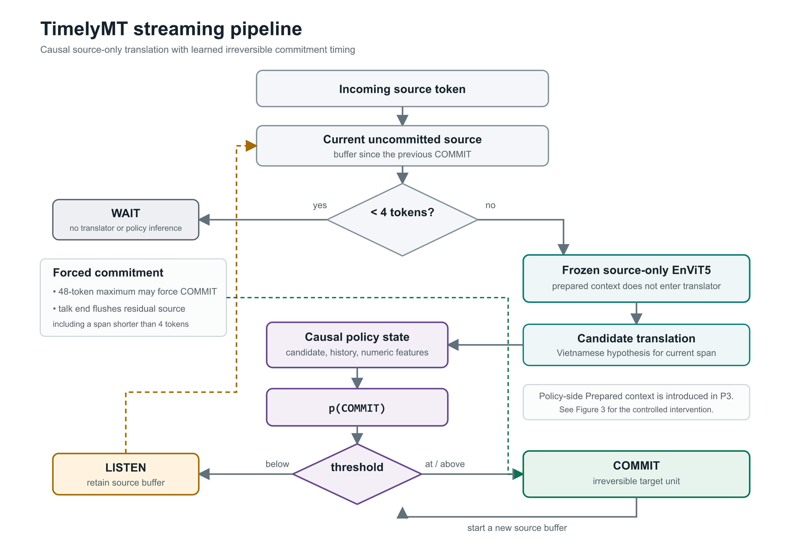
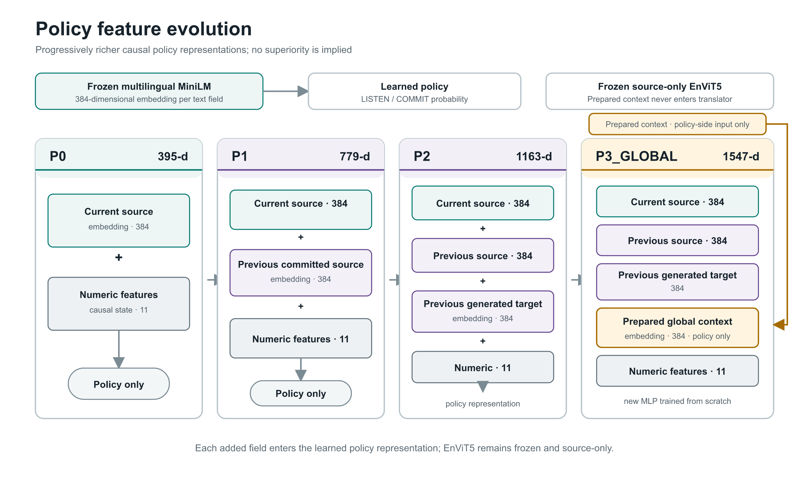
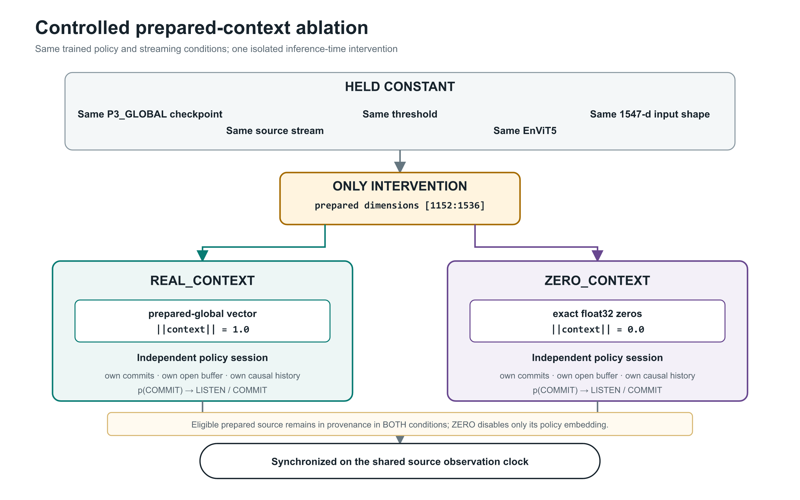
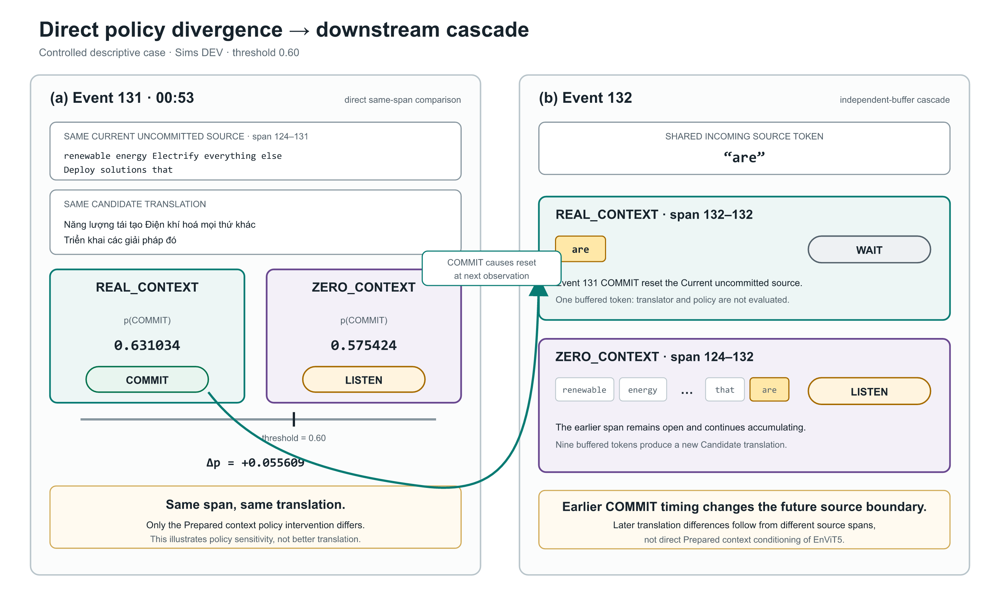

# TimelyMT: Context-Aware Low-Latency English-Vietnamese Streaming Translation for Technical Talks

*Policy Learning, Prepared Context, Controlled Ablation, and Interactive Streaming Analysis*

## Abstract

TimelyMT studies simultaneous, or streaming, English-to-Vietnamese translation for technical talks. Unlike offline translation, a streaming system must repeatedly decide whether to **LISTEN** for more source context or **COMMIT** a translation that cannot subsequently be revised. The project separates this timing problem from translation: a frozen, source-only EnViT5 model generates candidate Vietnamese translations, while a learned causal policy controls commitment. Policy development progressed from the V1 causal baseline to a V2 semantic-embedding policy and then to P3_GLOBAL, which adds genuinely available pre-talk material through a prepared-global policy representation. Prepared context is restricted by explicit provenance and leakage controls. Its effect was tested with a controlled REAL_CONTEXT versus ZERO_CONTEXT ablation using the same trained P3 checkpoint and replacing only the prepared-context input slice with exact zeros. The experiment establishes that prepared context causally changes the trained policy's commit behavior. However, the quality and latency effects vary by threshold, and `prepared-global-v0` does not demonstrate robust, threshold-independent improvement. A complete observation-level trace and static interactive viewer make WAIT, LISTEN, COMMIT, probability differences, irreversible boundaries, and downstream buffer cascades observable without performing model inference. TimelyMT therefore contributes a causal and interpretable framework for studying context-sensitive streaming commitment, not a claim of general system superiority.

## 1. Introduction

Offline machine translation receives a complete source sequence before producing its final output. Streaming translation instead operates on an incrementally revealed source. At each observation, it has only a causal prefix and must balance two competing objectives: waiting can provide more linguistic context and improve hypothesis stability, but it increases delay; committing earlier reduces delay but risks preserving a translation based on insufficient evidence. This latency-quality trade-off is central to simultaneous translation research (Ma et al., 2019; Arivazhagan et al., 2019).

The difficulty is amplified by irreversibility. A candidate translation may change as additional English tokens arrive, but a committed Vietnamese unit becomes fixed output. A poor boundary can therefore affect not only the current unit but also the source span, translation candidate, and policy history used at subsequent observations. TimelyMT frames this as a learned binary timing-policy problem: **when should the system LISTEN, and when should it COMMIT?** Translation quality is studied under a fixed upstream translator so that policy and segmentation effects remain conceptually separate.

The project objective is to develop and analyze a causal English-Vietnamese streaming translation framework for technical talks in which a learned policy controls irreversible output timing; to test whether genuine pre-talk information influences that policy; and to make the resulting behavior observable through faithful replay. The project does not seek to retrain EnViT5 or claim universal superiority over existing policies.

The report addresses four research questions:

| Research question | Scope |
|---|---|
| **RQ1** | How do richer causal contextual features affect learned streaming commit behavior relative to simpler policy representations? |
| **RQ2** | Does prepared pre-talk context causally influence policy decisions? |
| **RQ3** | Does the current prepared-global representation provide consistent quality/latency benefit? |
| **RQ4** | How can commit behavior be made observable and interpretable in a faithful streaming replay? |

The evidence answers these questions conservatively. V2 and P3 show that contextual policy representations are operationally viable, but V2 DEV results did not establish quality superiority over V1, and P3-versus-P2 is not a causal context comparison. The controlled P3 ablation answers RQ2 affirmatively for the trained checkpoint: prepared context changes commit behavior. RQ3 remains negative for the present representation because effects are threshold-dependent and inconsistent. The observation-level trace and static viewer address RQ4 without reconstructing absent probabilities or executing models in the interface.

## 2. System Overview

TimelyMT uses source tokens that arrive according to a simulated source-observation clock. Each policy session maintains an uncommitted source buffer beginning after its most recent commit. The frozen translator converts the current buffer into a candidate Vietnamese translation only after the minimum source length is reached. A causal policy then estimates `p(COMMIT)`, and a threshold converts this probability into LISTEN or COMMIT behavior.

```text
Source tokens arrive over time
        |
        v
Uncommitted source buffer
        |
        v
Candidate EnViT5 translation
        |
        v
Policy state and features
        |
        v
     p(COMMIT)
        |
        v
 LISTEN or COMMIT
        |
        v
Irreversible committed translation
```



*Figure 1. TimelyMT's causal streaming pipeline. EnViT5 translates only the Current uncommitted source, while a separate policy uses causal state to decide whether to WAIT, LISTEN, or irreversibly COMMIT.*

The runtime semantics are fixed:

| Condition | Runtime behavior |
|---|---|
| Fewer than 4 candidate source tokens | WAIT; no translator request and no policy inference |
| At least 4 candidate source tokens | Generate the candidate translation, construct causal state, and estimate `p(COMMIT)` |
| `p(COMMIT) < threshold` | LISTEN; retain and extend the open candidate buffer |
| `p(COMMIT) >= threshold` | COMMIT, unless a higher-precedence forced reason applies |
| Candidate reaches 48 source tokens | Force COMMIT with reason `max_length` |
| Talk ends with residual source | Flush the residual span with reason `talk_end`, including a span shorter than 4 tokens |
| After COMMIT | Preserve the target unit irreversibly and begin a new source buffer |

The translator and policy are distinct components:

| Component | Responsibility | Inputs excluded |
|---|---|---|
| **Translator** | Frozen EnViT5 produces a Vietnamese candidate using deterministic greedy decoding | Prepared documents, references, alignments, future source, and policy labels |
| **Policy** | Estimates when the current candidate is sufficiently stable to commit | Future source, target reference, and TEST information |

The translator is `VietAI/envit5-translation`, pinned at revision `840bc88104d5a4277af740eaedb024df8c3093e7` (Ngo et al., 2022). The wrapper supplies the required internal `en:` control prefix during preprocessing. The normalized generated hypothesis is then available to the policy. Crucially, prepared context never enters EnViT5; it is a policy-side feature only.

## 3. Data and Experimental Safety

### 3.1 Split discipline

The dataset follows a talk-level `TRAIN`/`DEV`/`TEST` discipline. Every derived prefix, hypothesis, pseudo-label, context record, and policy example inherits the split of its talk. Splitting derived observations independently would allow related portions of the same talk to cross experimental boundaries and would invalidate the intended evaluation.

| Split | Permitted role in the completed research |
|---|---|
| **TRAIN** | Fit policy parameters and numeric scaling; construct immutable upstream supervision |
| **DEV** | Explore policy variants, inspect threshold behavior, run controlled ablations, and build the research demo |
| **TEST** | Reserved for one later held-out evaluation after the research design is stabilized |

TEST remained untouched during the current policy research and demo development. No TEST result is reported, no held-out conclusion is made, and no current threshold or policy claim is based on TEST. The completed artifacts used for this report are TRAIN/DEV artifacts only.

### 3.2 Prepared-context eligibility

A prepared source is eligible only if all four metadata conditions hold:

| Required field | Required value |
|---|---|
| `classification` | `SAFE_PRETALK_CONFIRMED` |
| `available_before_talk` | `true` |
| `transcript_used` | `false` |
| `reference_used` | `false` |

These constraints ensure that a prepared document represents information genuinely obtainable before a talk rather than information derived from the completed source transcript, Vietnamese reference, alignments, or evaluation output. They matter because transcript- or reference-derived context could leak future or target-side information into a nominally causal policy. Eligibility is supported by recorded provenance metadata; it should not be interpreted as an independent historical audit of every external publication claim.

## 4. V1 Causal Baseline

V1 established the operational foundation for the later experiments. It froze Dataset v1 and its talk-level split, used the source-only EnViT5 translator, generated causal prefix-translation artifacts, defined numeric streaming and hypothesis-stability features, and evaluated learned P0/P1/P2 LISTEN/COMMIT policies alongside fixed and local-agreement baselines. Vietnamese references were evaluation-only and did not cross the translator or causal-policy boundary.

V1 supervision used future stability to generate TRAIN/DEV pseudo-labels. At an admissible causal state, the current EnViT5 hypothesis was compared with up to two future prefix hypotheses; sufficiently stable prefixes were labeled COMMIT, while unstable states were labeled LISTEN. Maximum-length and talk-end states were committed by construction. The future-derived stability value was stored as training-only oracle information and was not included in the causal policy features. Pseudo-label generation explicitly rejected TEST.

The selected V1 learned strategy was `learned_P1_0.60`, and the checkpoint stage is recorded as `dev-frozen-complete`. V1 became the reference point because it fixed the source-only translation boundary, causal rollout semantics, split identity, supervision lineage, metrics, and DEV selection process. Later V2 and P3 work reused its immutable supervision rather than changing the upstream translator or retrospectively redefining the baseline.

## 5. V2 Semantic Policy Model

V2 was a post-hoc exploratory DEV extension of V1. It replaced V1's sparse text representation with a frozen multilingual semantic encoder and a small nonlinear policy while preserving the causal state schema and the same eleven numeric features.

Although V1 and V2 both use the P0/P1/P2 variant labels, they are different policy implementations with different text representations and checkpoints; the shared labels describe corresponding levels of causal context rather than checkpoint identity.

The encoder was `sentence-transformers/paraphrase-multilingual-MiniLM-L12-v2`, pinned to revision `e62509716f15c5fd03a6fd3156a4bc5e43f83f26` (Reimers & Gurevych, 2019; Wang et al., 2020). Each text field produced a 384-dimensional vector through attention-mask-aware mean pooling followed by L2 normalization.

| Variant | Semantic text inputs | Numeric inputs |
|---|---|---:|
| **P0** | Current uncommitted source | 11 |
| **P1** | P0 plus previous committed source | 11 |
| **P2** | P1 plus previous generated target | 11 |

P2's complete input was therefore:

| P2 component | Dimensions |
|---|---:|
| Current source | 384 |
| Previous committed source | 384 |
| Previous generated target | 384 |
| Numeric features | 11 |
| **Total** | **1163** |

The eleven numeric features are summarized below; exact definitions are repeated in Appendix A.

| Group | Features |
|---|---|
| Source buffer | Token count, character count, elapsed source-clock milliseconds |
| Candidate target | Current token count, previous candidate token count, token-count delta |
| Candidate stability | Previous-current longest-common-prefix ratio, normalized change ratio |
| Commit history | Prior committed-unit count, previous committed source tokens, previous committed target tokens |



*Figure 2. Evolution of policy-side information from the current source and numeric features in P0 to causal history in P1/P2 and Prepared context in P3_GLOBAL. Prepared context enters only the policy; EnViT5 remains frozen and source-only.*

The historically selected V2 configuration is `v2_P2_0.50`. This selection remains a record of the completed DEV process, not a revised research winner. Most importantly, full DEV comparison did **not** establish V2 quality superiority over V1. V2 demonstrated a feasible semantic and nonlinear policy extension, but it did not justify a general improvement claim.

## 6. Prepared-Context Hypothesis

Technical talks may have genuine pre-talk material such as articles, project descriptions, papers, announcements, or background pages. Such sources may contain domain terminology or topical information before the source stream begins. TimelyMT's hypothesis was not that these documents should directly condition translation. Instead, prepared knowledge might alter how confidently the timing policy judges that the currently observed source span is sufficiently stable to commit.

The initial representation, `prepared-global-v0`, is talk-level and immutable during streaming:

1. Select only eligible sources using the leakage-controlled metadata predicate.
2. Sort sources by `source_id` and encode each source separately with the pinned MiniLM encoder.
3. For multiple sources, compute an equal-weight mean and L2-normalize the result.
4. For one source, use that source's normalized embedding directly.
5. For an empty eligible pool, use an exact 384-dimensional `float32` zero vector.

Empty pools are valid experimental states, not missing-data errors and not implicit context. The prepared-context corpus contains 12 TRAIN pools and 3 DEV pools. Five TRAIN talks and one DEV talk have eligible context, with eight eligible sources in total. The only context-bearing DEV talk is `ted-sims-witherspoon-ai-climate`; its eligible source is the official article identified as `deepmind-wind-energy-2019-lead`. The Jeff and Luis DEV talks have valid empty pools.

This representation is intentionally simple, but its simplicity also limits its expressiveness. It compresses all prepared material into one static global vector and provides no observation-specific retrieval mechanism.

## 7. P3_GLOBAL

P3_GLOBAL extends P2's policy representation with prepared global context. Its exact feature layout is fixed:

| P3 component | Dimensions | Index range |
|---|---:|---|
| Current source | 384 | `[0:384]` |
| Previous committed source | 384 | `[384:768]` |
| Previous generated target | 384 | `[768:1152]` |
| Prepared global context | 384 | `[1152:1536]` |
| Scaled numeric features | 11 | `[1536:1547]` |
| **Total** | **1547** | |

Prepared context affects the policy only. EnViT5 remains frozen and source-only. P3 was trained from scratch as a new multilayer perceptron because the P2 checkpoint cannot consume the additional 384-dimensional input. The architecture was:

```text
Linear(1547, 256)
GELU
Dropout(0.20)
Linear(256, 64)
GELU
Dropout(0.10)
Linear(64, 1)
```

P3 used immutable V1 TRAIN supervision. Checkpoint metadata records the following training facts:

| Training fact | Value |
|---|---:|
| Rows | 22,018 |
| LISTEN labels | 19,075 |
| COMMIT labels | 2,943 |
| `pos_weight` | 6.481481481481482 |
| Optimizer | AdamW |
| Learning rate | 0.001 |
| Weight decay | 0.0001 |
| Batch size | 256 |
| Epochs | 20 |
| Seed | 20260809 |
| Loss | `BCEWithLogitsLoss(pos_weight=TRAIN_LISTEN/TRAIN_COMMIT)` |

The persisted checkpoint is `checkpoints/policy_p3_global/P3_GLOBAL.pt`, with SHA-256:

```text
ccf829fdb7ab521cc12c299583efa7222c965440b1257ddfb35e03ddd7bcadb9
```

Checkpoint loading validates this digest and metadata before use. The repository's P3 checkpoint tests validated persistent restoration, including checkpoint, metadata, required upstream artifacts, and restored inference compatibility.

## 8. Full DEV Results

The official aggregate P3 DEV results are shown in Table 8.1. BLEU and chrF2 are translation-quality metrics (Papineni et al., 2002; Popović, 2015). AL and LAAL are token-level latency measures (Ma et al., 2019; Papi et al., 2022). Their values are reported exactly as stored in the completed aggregate artifacts; they were not recomputed for this report.

| Threshold | BLEU | chrF2 | AL | LAAL |
|---:|---:|---:|---:|---:|
| 0.30 | 25.21 | 61.96 | -1.24 | 2.63 |
| 0.40 | 25.09 | 61.70 | 0.43 | 9.81 |
| 0.50 | 25.65 | 61.92 | 7.54 | 23.54 |
| 0.60 | 26.10 | 61.29 | 0.77 | 48.55 |
| 0.70 | 28.32 | 61.98 | 19.16 | 80.25 |

Same-threshold deltas between P3 and P2 are mixed:

| Threshold | Delta BLEU | Delta chrF2 | Delta AL | Delta LAAL |
|---:|---:|---:|---:|---:|
| 0.30 | -0.15 | +0.56 | +4.89 | -12.63 |
| 0.40 | -0.08 | +0.53 | +18.32 | -7.60 |
| 0.50 | -0.34 | +0.47 | +26.96 | +3.95 |
| 0.60 | -1.65 | -0.77 | +0.36 | -33.75 |
| 0.70 | -1.72 | -0.76 | +25.58 | +14.01 |

These deltas are `P3 - P2`: positive BLEU or chrF2 favors P3 quality, while lower AL or LAAL is preferable under the reported latency metrics. No consistent P3 advantage emerged across both quality and latency objectives. Threshold changes also produced nonmonotonic official AL/LAAL behavior, reinforcing the need to report the full metric vector rather than infer latency from commit count alone.

P3-versus-P2 is **not** a valid causal comparison of prepared context. P3 was trained separately from scratch and differs from P2 even on Jeff and Luis, whose prepared vectors are exact zeros. Any difference may arise from new policy parameters, the additional feature dimension, or their interaction. This confounding motivates the controlled within-checkpoint ablation.

## 9. Controlled Prepared-Context Ablation

### 9.1 Experimental design

The controlled ablation compares two causal rollouts of the same trained P3 policy:

| Condition | Intervention |
|---|---|
| **REAL_CONTEXT** | Use the normal `prepared-global-v0` vector |
| **ZERO_CONTEXT** | Replace only prepared dimensions `[1152:1536]` with exact `float32` zeros |

Everything else is held fixed: the P3 checkpoint, 1547-dimensional input shape, pinned MiniLM encoder, eleven numeric features, frozen EnViT5 translator, threshold, incoming source stream, and streaming mechanics. Each rollout remains causally valid and therefore maintains its own commits, open buffer, and history after decisions diverge. Sharing history across conditions would erase the downstream consequences of the intervention.



*Figure 3. Controlled inference-time ablation. REAL_CONTEXT and ZERO_CONTEXT use the same P3 checkpoint and complete input layout; ZERO_CONTEXT changes only the prepared-global slice to exact zeros, while both policy sessions retain independent causal histories synchronized on the shared source observation clock.*

The comparison isolates inference-time reliance on prepared context within this trained P3 policy. It does not test all possible context representations or training strategies.

### 9.2 Ablation integrity

The naturally empty Jeff and Luis pools provide an invariance control. Their effective prepared vectors are already exact zeros, so REAL_CONTEXT and ZERO_CONTEXT should be identical under deterministic inference. Across the tested threshold grid, predictions were identical, commit counts were identical, and commit artifacts were identical for both talks. This result supports the interpretation that zero mode perturbs only prepared-context input behavior rather than unrelated rollout machinery.

### 9.3 Aggregate ablation results

All deltas in Table 9.1 are defined as:

```text
Delta = REAL_CONTEXT - ZERO_CONTEXT
```

Positive BLEU or chrF2 favors REAL_CONTEXT quality. Negative AL or LAAL favors REAL_CONTEXT on those latency metrics. Positive commit count means REAL_CONTEXT committed more often.

| Threshold | Delta BLEU | Delta chrF2 | Delta AL | Delta LAAL | Delta commits |
|---:|---:|---:|---:|---:|---:|
| 0.3 | -0.03 | -0.02 | -2.29 | -2.29 | +2 |
| 0.4 | -0.01 | -0.07 | +2.23 | +2.22 | +8 |
| 0.5 | -0.22 | +0.04 | +0.51 | -2.07 | +18 |
| 0.6 | +0.21 | +0.14 | +0.38 | -2.60 | +19 |
| 0.7 | -0.44 | -0.08 | -3.88 | -9.82 | +44 |

Because Jeff and Luis are invariant, aggregate differences originate from the context-bearing Sims talk. On Sims, REAL context produced more commits and shorter mean source segments at every tested threshold. The quality direction was inconsistent: REAL was worse on both quality metrics at 0.30, 0.40, and 0.70; mixed at 0.50; and better at 0.60.

At threshold 0.60 on Sims, REAL_CONTEXT yielded `+0.95` BLEU and `+0.63` chrF2, with 318 REAL commits versus 299 ZERO commits. This is the strongest positive descriptive case, but it is one threshold on one context-bearing DEV talk. It must not be interpreted as general superiority, a new winner, or evidence that prepared context consistently improves quality or latency.

### 9.4 Scientific interpretation

The controlled experiment establishes the following claim:

> Prepared context causally changes the trained P3 policy's commit behavior.

It does not establish the following stronger claim:

> Prepared context provides robust quality or latency superiority.

The central finding is therefore: **`prepared-global-v0` demonstrates measurable policy sensitivity to genuine pre-talk context, but the resulting quality/latency effects are threshold-dependent and inconsistent.** This distinction answers RQ2 while limiting RQ3. The experiment provides a causal intervention on one trained policy and one coarse context representation, not a general theorem about context-aware simultaneous translation.

## 10. Streaming Trace and Interpretability

### 10.1 Why commit-only artifacts were insufficient

Canonical rollout artifacts preserved committed spans, commit-time probabilities, reasons, features, and final predictions. They did not preserve every LISTEN observation, non-commit probability, or intermediate candidate translation. Consequently, a complete timestep-level replay could not be reconstructed faithfully from commit artifacts. In particular, a missing LISTEN probability cannot be inferred from a later commit record without inventing evidence.

The demo trace was therefore implemented as a separate, optional, append-only observation artifact. It records exactly one event for every incoming source observation and captures all three runtime states:

| Decision | Meaning | Translator/policy data |
|---|---|---|
| **WAIT** | Fewer than four source tokens in the current candidate | Not evaluated; values remain `null` |
| **LISTEN** | Inference occurred, but probability remained below threshold | Candidate, probability, and numeric features recorded |
| **COMMIT** | Policy or forced rule committed the current candidate | Candidate, probability, features, reason, and committed unit recorded |

Each event contains causal information such as the incoming source observation, current candidate source span, candidate translation, `p(COMMIT)`, decision and reason, eleven numeric features for non-WAIT events, and committed output where applicable. Embeddings and the full 1547-dimensional policy vector are not exposed by default. The trace reuses the translator output and probability already produced by the rollout; it performs no duplicate inference for observability.

### 10.2 Controlled trace case study: Sims at 0.60

The showcase trace pair uses `ted-sims-witherspoon-ai-climate` at threshold 0.60. Pair validation established the same checkpoint, the same 1,689 source events, the same source-observation clock, and the same threshold. The only experimental intervention is REAL versus zeroed prepared context.

| Trace statistic | Value |
|---|---:|
| Identical decisions | 1,200 / 1,689 (71.05%) |
| Different decisions | 489 / 1,689 (28.95%) |
| REAL COMMIT / ZERO LISTEN | 47 |
| REAL LISTEN / ZERO COMMIT | 23 |
| First decision divergence | Event 131, 53,000 ms (00:53) |
| Divergence regions | 159 |
| Longest consecutive decision-divergence region | Events 956-984, 29 events |
| Events with probabilities on both sides | 556 |
| Mean absolute probability delta | 0.125980 |
| Median absolute probability delta | 0.014456 |
| Maximum absolute probability delta | 0.929382 at event 584 (03:53) |

After the policies establish different candidate boundaries, many of the 489 divergent observations compare WAIT on one side with LISTEN or COMMIT on the other. WAIT has no probability and is never treated as probability zero.

### 10.3 First divergence: event 131

Event 131 provides the cleanest illustration because the policy histories have not yet produced different candidate spans at that observation.

| Field | REAL_CONTEXT | ZERO_CONTEXT |
|---|---|---|
| Event and time | 131 at 00:53 | 131 at 00:53 |
| Candidate source | `renewable energy Electrify everything else Deploy solutions that` | Same |
| Candidate translation | `Năng lượng tái tạo Điện khí hoá mọi thứ khác Triển khai các giải pháp đó` | Same |
| `p(COMMIT)` | 0.631034 | 0.575424 |
| Threshold | 0.60 | 0.60 |
| Decision | COMMIT | LISTEN |

The probability delta is `REAL - ZERO = +0.055609`. Both conditions use the same source span, candidate translation, checkpoint, and threshold; only the prepared-context policy input differs. REAL crosses the 0.60 threshold, while ZERO remains below it. This is a clean illustration of policy sensitivity and causal timing change. It is **not** evidence that the candidate translation is better under REAL, because the candidate translation is identical.

### 10.4 Irreversible cascade after the first divergence

At event 132, both conditions receive the same incoming token, `are`, but their open buffers differ because REAL committed at event 131:

| Condition | Candidate span | Decision | Interpretation |
|---|---|---|---|
| REAL_CONTEXT | 132-132 | WAIT | The prior commit reset the candidate; one token is below the inference minimum |
| ZERO_CONTEXT | 124-132 | LISTEN | The earlier span remains uncommitted and now contains nine tokens |

The stream is still shared, but the causal states are no longer directly identical. Across the complete pair, 829 events have different candidate-source starts. Among these boundary-divergent observations, 626 also have different candidate translations. These differences do not imply that prepared context was injected into EnViT5. Prepared context never enters the translator. Rather, the policy's earlier decision creates different source spans, and the same frozen source-only translator subsequently translates those different spans.



*Figure 4. Two-panel view of the controlled policy effect. (a) At event 131, identical source spans and Candidate translations yield probabilities on opposite sides of the 0.60 threshold. (b) At event 132, both policies receive `are`, but REAL_CONTEXT has reset to span 132-132 while ZERO_CONTEXT retains span 124-132, illustrating the resulting independent-buffer cascade.*

This cascade is a central interpretability result. In streaming systems, a local policy intervention can have persistent downstream consequences even when the translator itself is unchanged.

## 11. Interactive Static Demo

The repository includes a static artifact-replay viewer for the Sims 0.60 controlled trace. It loads two pre-generated DEV JSON traces in the browser and performs no model inference, rollout, training, evaluation, or threshold recomputation. Changing UI controls only navigates loaded artifacts; it does not alter recorded probabilities or decisions.

The viewer presents:

| Area | Observable information |
|---|---|
| Shared source stream | Incoming token, source observation clock, and causally observed source only |
| Independent policy cards | REAL/ZERO uncommitted buffers, candidate translation, `p(COMMIT)`, threshold, and WAIT/LISTEN/COMMIT |
| Prepared knowledge | Source provenance, eligibility controls, REAL effective norm 1.0, ZERO effective norm 0.0 |
| Committed timeline | Independent irreversible Vietnamese output units on the shared source clock |
| Navigation | Artifact bookmarks and next/previous differing decision |
| Playback | Auto playback at 0.5x, 1x, 2x, 4x, or 8x; step, reset, and pause on policy divergence |
| Viewing modes | Research details and presentation mode |

The interface explicitly distinguishes a shared incoming token from each policy's current uncommitted buffer. This prevents a misleading comparison after boundary divergence. It also shows WAIT as “not evaluated” rather than assigning a fabricated probability. Presentation mode hides secondary detail while retaining the core causal story.

**[Figure 5 - Interactive demo interface: manual capture pending at `reports/figures/figure-5-interactive-demo.png`]**

*Figure 5. Static DEV trace replay at Sims event 131 and threshold 0.60, showing the shared incoming source, independent REAL_CONTEXT and ZERO_CONTEXT buffers, the direct policy divergence, Prepared context provenance, and irreversible committed-output timelines.*

The observation timestamps represent when streaming source observations become available in the simulated source clock. They do not claim forced-aligned acoustic word timing. The viewer is therefore a research observability instrument rather than a live speech-translation product.

## 12. Discussion

### 12.1 Answers to the research questions

**RQ1: How do richer causal contextual features affect learned streaming commit behavior relative to simpler policy representations?** Richer causal contextual features can be incorporated into the learned policy and are associated with material differences in segmentation and timing. However, V2 DEV results did not establish quality superiority over V1, and P3-versus-P2 remains confounded by separate training. The current evidence supports feasibility and behavioral difference, not general improvement.

**RQ2: Does prepared pre-talk context causally influence policy decisions?** Yes, within the trained P3 checkpoint. The REAL/ZERO intervention holds the model and all non-prepared inputs constant, empty-context controls are invariant, and the context-bearing Sims trace contains clean same-span probability and decision divergences.

**RQ3: Does the current prepared-global representation provide consistent quality/latency benefit?** No. Aggregate and Sims-specific effects change direction across thresholds. REAL consistently creates more, shorter Sims segments, but quality effects are inconsistent, and the latency metrics do not improve uniformly.

**RQ4: How can commit behavior be made observable and interpretable in a faithful streaming replay?** An append-only per-observation trace records WAIT, LISTEN, and COMMIT without reconstructing missing evidence. A static viewer synchronizes independent policy sessions on the common source clock and exposes both clean same-span divergences and later boundary cascades.

### 12.2 Evidence boundaries

Three evidence classes should remain separate:

| Evidence class | Examples | Permitted interpretation |
|---|---|---|
| Official stored metrics | BLEU, chrF2, AL, LAAL | Report completed DEV outcomes exactly |
| Derived artifact statistics | Commit counts, divergence regions, probability deltas | Describe behavior present in validated artifacts |
| Scientific interpretation | Causal sensitivity, lack of robust superiority | Draw only conclusions supported by the controlled design and coverage |

The causal claim concerns policy behavior, not translation semantics. At event 131, translation is held constant and only the policy decision changes. At later events, candidate translations can differ, but the mechanism is changed source segmentation rather than direct prepared-context conditioning of EnViT5.

## 13. Limitations

1. Only one of the three DEV talks has eligible prepared context, so the context-bearing result is based on a single talk.
2. The complete prepared corpus contains only eight eligible sources, limiting topical and document diversity.
3. `prepared-global-v0` is a coarse, static talk-level average rather than an observation-specific representation.
4. Equal-weight global averaging may dilute locally relevant information and gives no learned preference among sources.
5. P3 training was not explicitly optimized or regularized to exploit prepared context robustly.
6. Policy behavior and observed quality/latency effects are threshold-sensitive.
7. The controlled ablation isolates inference-time use within one trained P3 policy; it does not characterize every possible context-aware training strategy.
8. DEV contains only three talks, so aggregate estimates have limited breadth.
9. TEST remains untouched. Consequently, no held-out TEST conclusion or final generalization claim is made.
10. The demo replays static artifacts and contains no live audio, model execution, translator inference, or online rollout.
11. Observation timestamps are simulated source-observation times, not claims of forced-aligned word-level acoustic timing.
12. BLEU, chrF2, AL, and LAAL summarize different aspects of behavior and are nonmonotonic at some thresholds; no single metric provides a complete policy assessment.

## 14. Future Work

Future experiments should maximize information value rather than repeat undirected retraining:

1. Replace one global average with retrieval-based or local prepared context selected for the current source observation.
2. Develop a context-aware training objective or regularization strategy that encourages appropriate, measurable reliance on prepared information.
3. Expand the corpus of genuinely pre-talk sources with explicit provenance and the same leakage controls.
4. Add more context-bearing DEV or evaluation talks so effects can be assessed across speakers and topics.
5. Calibrate the policy deliberately across thresholds rather than infer a universal operating point from one descriptive case.
6. Extend timestep analysis to relate probability shifts, same-span divergences, stability features, boundary cascades, and local prepared-document relevance.
7. Only after the representation, training design, and evaluation protocol are stabilized, freeze the design and evaluate once on untouched TEST.

## 15. Conclusion

TimelyMT demonstrates a causal, observable streaming translation framework in which a learned policy controls irreversible English-Vietnamese translation commitments. The frozen source-only EnViT5 translator and policy-side timing model remain explicitly separated, enabling segmentation and context effects to be studied without changing the translation model.

The trained P3 policy is demonstrably sensitive to prepared pre-talk context, which can alter commit timing under otherwise identical conditions. Empty-context invariance and the REAL/ZERO same-checkpoint intervention support this causal policy claim. The first Sims divergence at event 131 provides a particularly clear example: identical source and translation candidates produce probabilities on opposite sides of the same threshold solely because the prepared policy input differs.

However, `prepared-global-v0` does not yet provide a robust, threshold-independent improvement in translation quality or latency. The quality direction changes across thresholds, the positive 0.60 Sims case is descriptive evidence from one context-bearing DEV talk, and no TEST result exists. The appropriate conclusion is therefore continued research into better context selection, context-aware policy learning, calibration, and broader context coverage, rather than a claim of final system superiority.

# Appendix

## Appendix A. Eleven Numeric Features

| Feature | Definition |
|---|---|
| `source_buffer_token_count` | Number of source tokens in the current uncommitted candidate span |
| `source_buffer_character_count` | Character count of the current source span after joining tokens with spaces |
| `source_clock_elapsed_ms` | Emit time of the candidate's final token minus emit time of its first token |
| `current_target_token_count` | Whitespace-token count of the current candidate translation |
| `previous_target_token_count` | Whitespace-token count of the preceding candidate translation for the same open span; zero when absent |
| `target_token_count_delta` | Current candidate target-token count minus previous candidate target-token count |
| `previous_current_lcp_ratio` | Longest common whitespace-token prefix of current and previous candidates, divided by the previous candidate length with a denominator floor of one |
| `previous_current_change_ratio` | One minus the sequence-matching ratio between previous and current candidate target tokens |
| `prior_committed_unit_count` | Number of target units already committed in the current policy session |
| `previous_committed_source_tokens` | Source-token count of the most recent committed unit; zero before the first commit |
| `previous_committed_target_tokens` | Target-token count of the most recent committed unit; zero before the first commit |

These numeric values are scaled using statistics fitted on TRAIN before entering V2/P3. WAIT observations below four candidate source tokens do not construct or expose this policy state.

## Appendix B. Important Model and Checkpoint Identifiers

| Artifact | Identifier |
|---|---|
| Translator | `VietAI/envit5-translation` |
| Translator revision | `840bc88104d5a4277af740eaedb024df8c3093e7` |
| Translator decoding | Greedy: `do_sample=false`, `num_beams=1` |
| Semantic encoder | `sentence-transformers/paraphrase-multilingual-MiniLM-L12-v2` |
| Semantic encoder revision | `e62509716f15c5fd03a6fd3156a4bc5e43f83f26` |
| Encoder pooling | `attention-mask-mean-l2-v1` |
| Embedding dimension | 384 |
| Prepared schema | `prepared-context-v0` |
| Prepared representation | `prepared-global-v0` |
| Historical V1 selection | `learned_P1_0.60` |
| Historical V1 checkpoint stage | `dev-frozen-complete` |
| Historical V2 selection | `v2_P2_0.50` |
| P3 checkpoint | `checkpoints/policy_p3_global/P3_GLOBAL.pt` |
| P3 checkpoint SHA-256 | `ccf829fdb7ab521cc12c299583efa7222c965440b1257ddfb35e03ddd7bcadb9` |

## Appendix C. Experimental Thresholds

The completed P2, P3, and P3 REAL/ZERO DEV grids use thresholds:

```text
0.30, 0.40, 0.50, 0.60, 0.70
```

At inference time, a non-forced policy COMMIT occurs when `p(COMMIT) >= threshold`. The interactive case study uses 0.60 because it provides the most informative positive descriptive controlled-ablation case, not because it has been established as a universally best threshold.

## Appendix D. Demo Trace Schema Summary

| Scope | Principal fields |
|---|---|
| Run identity | Artifact version, run ID, talk ID, split, strategy, threshold, prepared mode, checkpoint SHA-256 |
| Source stream | Token count, final emit time, simulated source clock, observation key |
| Prepared provenance | Representation version, eligible source IDs/checksums, eligibility status, embedding dimension, stored and effective norms, mode explanation |
| Observation identity | `event_index`, `observation_ms`, `source_token_end` |
| Candidate state | Source start/end/text, candidate translation, previous candidate translation |
| Decision state | `p_commit`, threshold, WAIT/LISTEN/COMMIT, reason, forced flag |
| Commit state | Committed unit index, committed source text, committed target text |
| Causal numeric state | Eleven numeric features for LISTEN and COMMIT; `null` for WAIT |

No target reference, alignment, future source, oracle training field, raw embedding, or full policy input is included by default. REAL and ZERO traces synchronize on event index, source-token end, and observation time, never on commit index.

## Appendix E. Reproducibility Commands Without TEST Access

The report is based on completed artifacts; reproduction of the written analysis does not require training, rollout, or evaluation. The following commands are limited to static serving, read-only validation/comparison of the existing DEV demo traces, and repository tests. They do not access TEST when invoked exactly as shown.

```powershell
# Serve the static artifact viewer; no model execution occurs.
python -m http.server 8000
# Open http://localhost:8000/demo/

# Validate the two existing DEV trace documents.
python scripts/validate_demo_trace.py outputs/demo_traces/sims-real-0.60.json
python scripts/validate_demo_trace.py outputs/demo_traces/sims-zero-0.60.json

# Run focused offline tests for trace validation/comparison and checkpoint persistence.
$env:PYTHONPATH='src'
python -m unittest tests.research.test_compare_demo_traces tests.research.test_p3_checkpointing -v

# Check documentation diff hygiene.
git diff --check -- reports/final-report.md
```

The repository also contains researcher-operated TRAIN/DEV model commands, but they are intentionally omitted here because this final report requires no model work. TEST must remain untouched.

## Appendix F. Key Repository Artifact Paths

| Purpose | Repository path |
|---|---|
| Long research synthesis | `docs/research-final-summary.md` |
| Short research synthesis | `docs/research-final-summary-short.md` |
| Trace contract | `docs/demo-trace-spec.md` |
| Demo UI contract | `docs/demo-ui-spec.md` |
| P3 single-talk sanity report | `reports/p3_global_sims_0.50_sanity.md` |
| Full P3 DEV analysis | `reports/p3_global_full_dev_analysis.md` |
| Controlled context ablation | `reports/p3_prepared_context_ablation.md` |
| Sims 0.60 trace analysis | `reports/demo_trace_sims_0.60_analysis.md` |
| Demo operation | `demo/README.md` |
| Presentation walkthrough | `demo/PRESENTATION.md` |
| P3 experiment config | `configs/experiments/policy-p3-global.json` |
| P3 checkpoint metadata | `checkpoints/policy_p3_global/P3_GLOBAL.metadata.json` |
| Prepared-context manifest | `data/prepared_context/manifest.json` |
| REAL trace | `outputs/demo_traces/sims-real-0.60.json` |
| ZERO trace | `outputs/demo_traces/sims-zero-0.60.json` |
| Demo bookmarks | `outputs/demo_traces/sims-0.60-bookmarks.json` |

# References

Arivazhagan, N., Cherry, C., Macherey, W., Chiu, C.-C., Yavuz, S., Pang, R., Li, W., & Raffel, C. (2019). Monotonic infinite lookback attention for simultaneous machine translation. *ACL 2019*, 1313-1323. https://doi.org/10.18653/v1/P19-1126

Ma, M., Huang, L., Xiong, H., Zheng, R., Liu, K., Zheng, B., Zhang, C., He, Z., Liu, H., Li, X., Wu, H., & Wang, H. (2019). STACL: Simultaneous translation with implicit anticipation and controllable latency using prefix-to-prefix framework. *ACL 2019*, 3025-3036. https://doi.org/10.18653/v1/P19-1289

Ngo, C., Trinh, T. H., Phan, L., Tran, H., Dang, T., Nguyen, H., Nguyen, M., & Luong, M.-T. (2022). MTet: Multi-domain translation for English and Vietnamese. *arXiv:2210.05610*. https://doi.org/10.48550/arXiv.2210.05610

Papi, S., Gaido, M., Negri, M., & Turchi, M. (2022). Over-generation cannot be rewarded: Length-adaptive average lagging for simultaneous speech translation. *AutoSimTrans 2022*, 12-17. https://doi.org/10.18653/v1/2022.autosimtrans-1.2

Papineni, K., Roukos, S., Ward, T., & Zhu, W.-J. (2002). Bleu: A method for automatic evaluation of machine translation. *ACL 2002*, 311-318. https://doi.org/10.3115/1073083.1073135

Popović (2015). chrF: Character n-gram F-score for automatic MT evaluation. *WMT 2015*, 392-395. https://doi.org/10.18653/v1/W15-3049

Reimers, N., & Gurevych, I. (2019). Sentence-BERT: Sentence embeddings using Siamese BERT-networks. *EMNLP-IJCNLP 2019*, 3982-3992. https://doi.org/10.18653/v1/D19-1410

Wang, W., Wei, F., Dong, L., Bao, H., Yang, N., & Zhou, M. (2020). MiniLM: Deep self-attention distillation for task-agnostic compression of pre-trained transformers. *NeurIPS 2020*.
